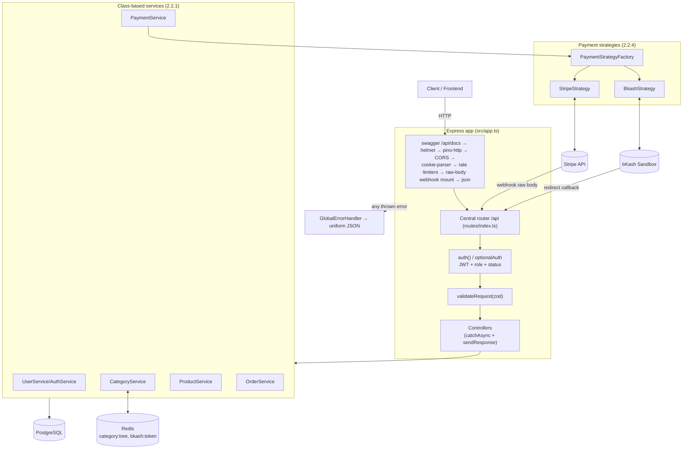
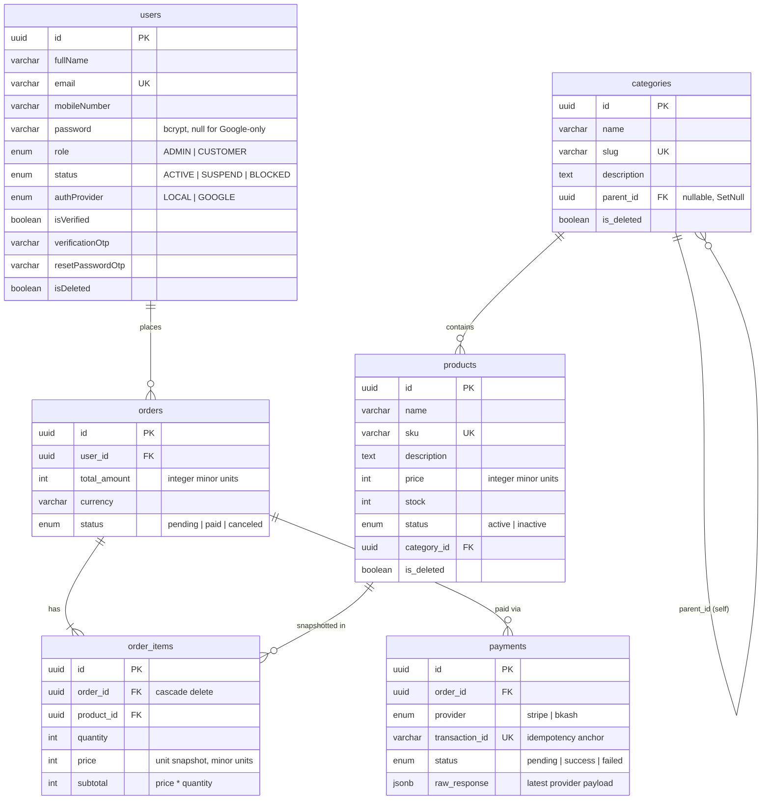
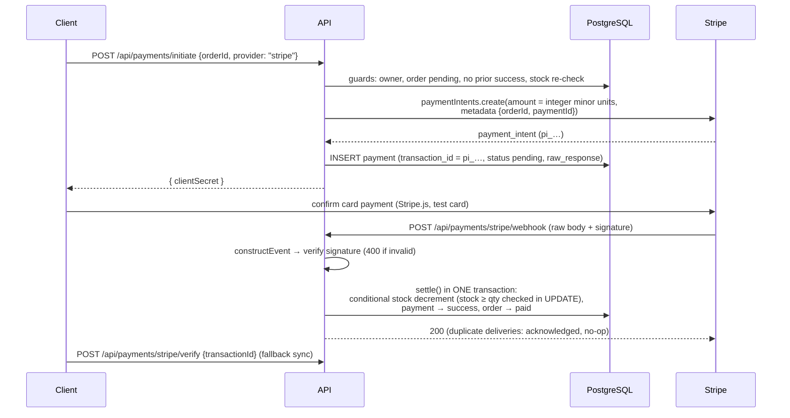
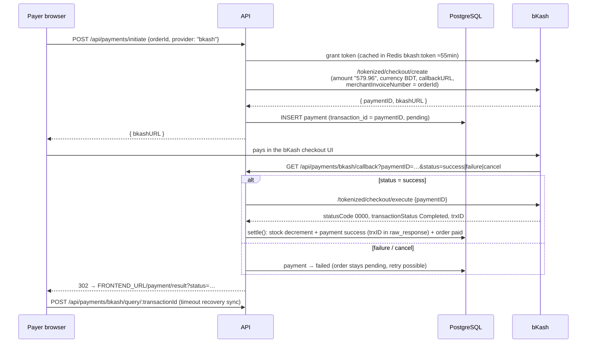

# Architecture — E-commerce Ordering & Payment System

A modular, layered REST API built with **Express 5 + TypeScript (ESM)**, **Prisma 7** ORM, and **PostgreSQL**, implementing a complete e-commerce flow: users, hierarchical categories, products, orders, and payments through **Stripe** (test mode) and **bKash** (tokenized checkout sandbox) behind a swappable strategy interface. Redis caches the category tree; pino provides structured logging; every error funnels through one handler.

For endpoint-by-endpoint behavior see **[DOCUMENTATION.md](DOCUMENTATION.md)**; for setup see **[README.md](README.md)**; live API docs at **`/api/docs`** (Swagger UI).

---

## 1. Tech Stack

| Layer         | Technology                                                      | Purpose                                            |
| ------------- | --------------------------------------------------------------- | -------------------------------------------------- |
| Runtime       | Node.js ≥ 20 (ESM)                                              | Server runtime                                     |
| Language      | TypeScript 5 (strict)                                           | Type safety, compiled to `dist/`                   |
| Web framework | Express 5                                                       | HTTP routing & middleware                          |
| ORM           | Prisma 7 (`prisma-client` generator + `@prisma/adapter-pg`)     | Type-safe DB access over the `pg` driver           |
| Database      | PostgreSQL                                                      | Persistent storage                                 |
| Cache         | Redis (ioredis) — **optional in dev**, DB fallback              | Category tree cache, bKash token cache             |
| Validation    | Zod                                                             | Request-body schemas on every write endpoint       |
| Auth          | jsonwebtoken + bcrypt + google-auth-library                     | JWT sessions, password hashing, Google OAuth       |
| Payments      | `stripe` SDK; axios client for bKash tokenized checkout         | Provider integrations behind the strategy pattern  |
| Logging       | pino + pino-http                                                | Structured app + request logs                      |
| Security      | helmet, express-rate-limit, CORS whitelist                      | Headers, throttling (`/api/auth`, `/api/payments`) |
| API docs      | swagger-jsdoc + swagger-ui-express                              | OpenAPI 3 at `/api/docs`                           |
| Tests         | Jest (ESM) + ts-jest + Supertest                                | 86 tests: unit, API, webhook                       |
| Packaging     | Docker multi-stage + docker-compose (api, postgres:16, redis:7) | One-command run                                    |

---

## 2. System Architecture



**Request lifecycle:** route → (optional) `auth()` → `validateRequest(zod)` → controller (`catchAsync` + `sendResponse`) → class-based service → Prisma → PostgreSQL. Errors thrown anywhere land in `GlobalErrorHandler` (Zod → 400 field list, `ApiError` → own status, Prisma P2002 → 409, P2025 → 404, etc.), logged via pino, stack traces only in development.

---

## 3. Entity-Relationship Diagram



Indexes: every FK column, plus `products(status, is_deleted, name)`, `orders(status, created_at)`, `payments(status, provider)`, `categories(is_deleted)`, and unique `order_items(order_id, product_id)`. Categories/products soft-delete (`is_deleted` + `deleted_at`); orders and payments are financial records — never deleted. New tables map columns to snake_case (`@map`) so the physical schema matches the assessment spec; enums store the spec's lowercase strings literally (intentional deviation from the boilerplate's uppercase style).

**Money rule (2.2.3):** every amount is an **integer in minor units** (cents/poisha) — `price`, `subtotal`, `total_amount`. Conversion happens only inside payment strategies: Stripe gets the integer as-is; bKash gets `toMajorUnitsString()` (`57996 → "579.96"`). Helpers in [src/shared/money.ts](src/shared/money.ts), unit-tested.

---

## 4. Payment Flows

### Stripe (test mode)



### bKash (tokenized checkout, sandbox)



**Settlement invariants (2.1.6):** stock is decremented **only** on successful payment, inside one transaction, with the `stock >= quantity` condition inside the UPDATE itself; the affected-row count is checked. A shortfall rolls back every decrement, records the payment as `success` with a `STOCK_SHORTFALL_AFTER_PAYMENT` anomaly in `raw_response`, leaves the order `pending`, and logs loudly — the documented manual-refund path. Settlement is idempotent, anchored on the unique `transaction_id`: an already-settled payment acknowledges duplicates without effect (webhook double-delivery test proves it).

---

## 5. Where Each Design Requirement Lives (2.2.x)

| Req   | Requirement      | Implementation                                                                                                                                                                                                                                                                                                                                                                                                                                      |
| ----- | ---------------- | --------------------------------------------------------------------------------------------------------------------------------------------------------------------------------------------------------------------------------------------------------------------------------------------------------------------------------------------------------------------------------------------------------------------------------------------------- |
| 2.2.1 | OOP              | Class-based services exported as singletons: [CategoryService](src/app/modules/category/category.service.ts), [ProductService](src/app/modules/product/product.service.ts), [OrderService](src/app/modules/order/order.service.ts), [PaymentService](src/app/modules/payment/payment.service.ts); strategy classes `StripeStrategy`, `BkashStrategy`, `BkashClient`, `PaymentStrategyFactory`                                                       |
| 2.2.2 | Data structures  | Relational schema with FK-covering indexes ([prisma/schema.prisma](prisma/schema.prisma)); hierarchical `categories` via self-referencing `parent_id`; in-memory tree (`Map` + adjacency list → forest) in [category.tree.ts](src/app/modules/category/category.tree.ts)                                                                                                                                                                            |
| 2.2.3 | Algorithms       | Deterministic totals: pure `mergeOrderItems` + `calculateOrderTotals` ([order.utils.ts](src/app/modules/order/order.utils.ts)) — DB prices only, integer math, duplicate merging; safe stock reduction via conditional `updateMany` inside the settlement transaction ([payment.service.ts](src/app/modules/payment/payment.service.ts))                                                                                                            |
| 2.2.4 | Strategy pattern | [`PaymentStrategy`](src/app/modules/payment/strategies/payment.strategy.ts) interface (`initiate` / `verify` / `handleCallback`) + [factory](src/app/modules/payment/strategies/strategy.factory.ts). Order/payment logic depends only on the interface — **adding a provider = one strategy class + one `register()` call, zero edits to order logic** (the test suite proves it by swapping in a stub strategy)                                   |
| 2.2.5 | DFS + caching    | Explicit **iterative, stack-based DFS** in [category.tree.ts](src/app/modules/category/category.tree.ts) (`dfsFindNode`, `dfsCollectSubtreeIds`); used by product list `categoryId` subtree expansion and `GET /products/:id/recommendations` (subtree first, parent-subtree widening fallback). Tree cached in Redis `category:tree` (TTL `CATEGORY_TREE_TTL`), invalidated on every category write, with warn-once DB fallback when Redis is down |

---

## 6. Directory Structure

```
.
├── prisma/
│   ├── schema.prisma                # User, Category, Product, Order, OrderItem, Payment + enums
│   ├── migrations/                  # incl. 20260710011500_ecommerce_init
│   └── seed.ts                      # idempotent: admin, 10-node category tree, 17 products
├── prisma.config.ts                 # Prisma 7 config + seed hook
├── src/
│   ├── server.ts                    # bootstrap: DB check, listen, graceful shutdown
│   ├── app.ts                       # middleware chain (see §2), swagger, webhook raw mount
│   ├── config/index.ts              # env config; fail-fast JWT + per-provider credential checks
│   ├── app/
│   │   ├── routes/index.ts          # /users /auth /categories /products /orders /payments
│   │   ├── docs/                    # swagger spec builder + per-module @openapi doc files
│   │   ├── lib/
│   │   │   ├── prisma.ts            # PrismaClient singleton (pg adapter, network timeout fix)
│   │   │   └── redis.ts             # safe helpers: redisGet/Set/Del never throw (DB fallback)
│   │   ├── middlewares/
│   │   │   ├── auth.ts              # JWT + role + live status check
│   │   │   ├── optionalAuth.ts      # public routes, admin-widened visibility
│   │   │   ├── validateRequest.ts   # Zod body validation
│   │   │   ├── rateLimiter.ts       # auth + payment limiters (webhooks exempt)
│   │   │   └── globalErrorHandler.ts
│   │   └── modules/
│   │       ├── auth/  user/         # boilerplate auth: OTP registration, login, Google OAuth
│   │       ├── category/            # + category.tree.ts (DFS exhibit)
│   │       ├── product/
│   │       ├── order/               # + order.utils.ts (pure totals)
│   │       └── payment/
│   │           └── strategies/      # payment.strategy.ts, stripe.strategy.ts,
│   │                                # bkash.client.ts, bkash.strategy.ts, strategy.factory.ts
│   ├── errors/                      # ApiError, handleZodError, handlePrismaError
│   ├── helpers/                     # jwtHelpers, paginationHelper, fileUploader
│   ├── shared/                      # catchAsync, sendResponse, pick, emailSender, logger, money
│   └── generated/prisma/            # generated client (prisma generate)
├── tests/                           # unit / api / webhook suites + isolated test DB setup
├── Dockerfile                       # multi-stage; entrypoint: migrate deploy → node dist/server.js
├── docker-compose.yml               # api + postgres:16 + redis:7, healthchecks, volumes
└── .env.example  .env.test.example  .env.docker.example
```

---

## 7. Module Pattern & Extension

Every domain lives in `src/app/modules/<name>/` as `<name>.route.ts` (middleware wiring) / `<name>.controller.ts` (thin HTTP layer) / `<name>.service.ts` (business logic — class-based in the e-commerce domains) / `<name>.validation.ts` (Zod), plus optional `constant/interface/utils` files. New modules can be scaffolded with `npm run generate <name>` and are registered in `src/app/routes/index.ts`.

**Adding a payment provider** (the 2.2.4 grading criterion): implement `PaymentStrategy` in `strategies/<provider>.strategy.ts`, add its enum value to `PaymentProvider` in the schema, and call `paymentStrategyFactory.register(new YourStrategy())`. `OrderService`/`PaymentService` need no changes.

---

## 8. Security & Operational Design

- **JWT** (`{ id, email, role }`, 7d default) via `Authorization: Bearer`, httpOnly `token` cookie, or `x-auth-token`; `auth()` re-reads the user per request so blocked/suspended/deleted accounts lose access immediately; role whitelists (`auth("ADMIN")`) guard admin surfaces.
- **Validation everywhere:** Zod on every body; prices accepted only as integers; order items accept `productId`/`quantity` only — client prices are ignored.
- **Secrets only via env** with fail-fast: boot refuses without `JWT_SECRET`; provider credentials required only when `STRIPE_ENABLED`/`BKASH_ENABLED` is true.
- **Rate limiting** on `/api/auth/*` and `/api/payments/*` (100 req/15 min/IP), with Stripe webhook + bKash callback exempted; **helmet** headers (CSP allows the landing page's inline styles); CORS origin whitelist from `CORS_ORIGINS` (works with a Vercel frontend).
- **Logging:** pino JSON logs; request logging via pino-http; payment lifecycle events (initiated / settled / failed / anomaly) carry `orderId`/`paymentId` context and never contain secrets; `GlobalErrorHandler` logs every error with method/path/status.
- **Graceful lifecycle:** boot-time DB connectivity check; `SIGTERM`/`SIGINT`/uncaught handlers close the server and disconnect Prisma.
- **Dev conveniences (never in production):** OTPs logged at `debug` when mail is unconfigured or SMTP fails; email transport failures degrade to "not sent" outside production but throw in production.

---

## 9. Testing (86 tests, 10 suites)

- **Unit:** money helpers; order totals (determinism, duplicate merge, integer guards); DFS (fixtures incl. 20 000-deep chain — iterative traversal can't overflow); StripeStrategy (mock SDK + real offline HMAC signature verification); BkashStrategy (mock client: create/execute/query mapping).
- **API (Supertest on the exported `app`):** full register→OTP→login→me flow; product CRUD permissions (anonymous/customer/admin, 409 sku, soft delete, inactive visibility); order create (server totals, ignored client prices, stock/active guards, ownership 404); payment initiate guards through a stubbed strategy.
- **Webhook:** Stripe signed success (settles + decrements once), double delivery (no-op), failed intent, invalid signature 400, unknown transaction ack, stock-shortfall anomaly; bKash callback success/duplicate/execute-failure/failure/cancel.
- **Isolation:** the suite derives `ecommerce_test` from `DATABASE_URL` (or uses `DATABASE_URL_TEST`), creates + migrates it in `globalSetup`, truncates before each run, and refuses to run if the test URL equals the dev URL. Providers run with dummy credentials — no network calls to Stripe/bKash in tests.

Run: `npm test` · coverage: `npm run test:coverage`.
